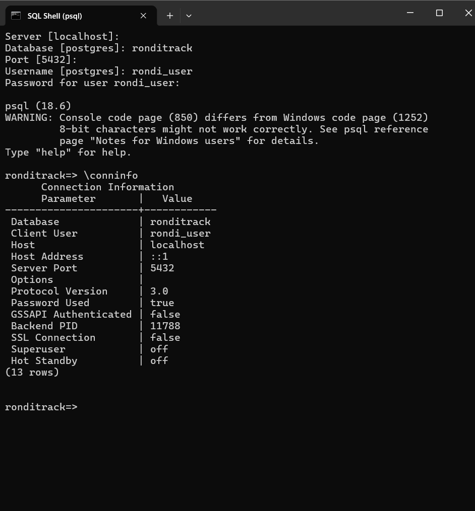
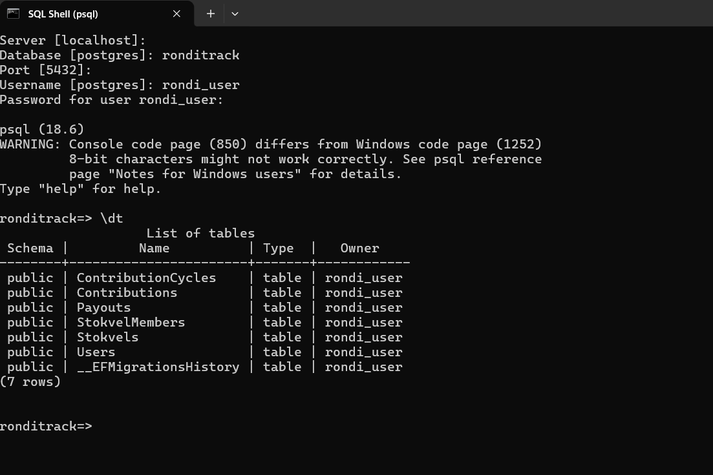

# RondiTrack API (Week 4, Day 1)

A .NET 10 Web API for tracking stokvels and their members, with in-memory data.

## Controllers vs Minimal APIs
I chose Controllers. The assignment asks for explicit attribute routing and a nested
stokvel -> members route. Controllers keep each resource's routes together in one class,
which stays readable as the API grows.

## Rules enforced in code
**User:** name required (max 100 chars); email required, valid format and normalised to
lowercase. Emails are unique (409 on duplicates). A user who belongs to a stokvel cannot be
deleted, because removing a member mid-rotation would break payouts.

**Stokvel:** name required; contribution must be > 0 with at most 2 decimal places;
frequency must be Weekly/Fortnightly/Monthly; capacity 2-50 (a rotation needs at least 2
people). A member can't join twice, a full stokvel can't take more members, and capacity
can't be lowered below the current member count.

These live in the entity constructors and methods, so an invalid User or Stokvel cannot
be created. Members is exposed read-only; the only way to change it is AddMember/RemoveMember.

## Money
ContributionAmount is `decimal`, not `double`. Binary floating point can't represent
values like 0.1 exactly, which is unacceptable for money.

## Status codes
200 OK, 201 Created (with Location), 204 No Content, 400 invalid input,
404 not found, 409 conflict, 422 request references a non-existent user.

## Run it
    dotnet run
Open http://localhost:5134/scalar/v1 (port may vary - check your terminal output).
Seeded IDs: users 10000000-0000-0000-0000-00000000000{1-6},
stokvels 20000000-0000-0000-0000-00000000000{1-2}.

## Assignment 4.2: DTOs, Service Layer & Idempotency

### DTOs and mapping
Every endpoint now sends and receives DTOs (in `Dtos/`), never the `User`/`Stokvel`/`Contribution`
entities directly. `StokvelResponse` exposes `memberCount` and `isFull` instead of the internal
member list, since that's what a caller actually needs.

Mapping is done by hand in `Dtos/MappingExtensions.cs`, one `ToResponse()` extension method per
entity. I kept manual mapping even setting the constraint aside: this project touches money, and
an auto-mapping library matches fields by name/convention, which is exactly the over-posting risk
the brief warns about — a typo'd or renamed field could silently stop mapping, or worse, a new
internal field could get exposed without anyone noticing. A hand-written method makes every field
that crosses the boundary an explicit, reviewable line of code.

### Service layer
Two services hold the real decisions:

- `StokvelMembershipService` — adding/removing a member spans two repositories (Stokvel and User)
  and needs to check both exist before touching either. That's more than validation; it's an
  orchestration decision, so it moved out of the controller.
- `ContributionService` — recording a contribution is RondiTrack's first money-moving operation.
  It has to check the stokvel exists, the user exists, the user is actually a member, the same
  cycle hasn't already been paid, and it owns the idempotency check. That's several decisions
  spanning three repositories plus the idempotency store — clearly service-layer work, not a
  controller if-statement.

Everything else (basic CRUD) stayed in the controllers, since create/read/update/delete on a
single entity is just HTTP translation plus the validation the entity already enforces on itself.

### Idempotency design
The client sends an `Idempotency-Key` header with each `POST /api/stokvels/{id}/contributions`
request. The service:
1. Computes a hash of the request (stokvel id + user id + cycle + amount).
2. Looks up the key in `IIdempotencyStore` (in-memory, same pattern as the repositories).
3. If the key exists with the *same* hash: returns the original response again, without touching
   the data a second time (a safe replay).
4. If the key exists with a *different* hash: rejects with 409 — reusing a key for a different
   request is not the same as retrying, and silently accepting it would hide a real client bug.
5. If the key is new: does the real work (all the existence/membership/duplicate-cycle checks),
   records the contribution, and saves the response under that key for future replays.

Tested in Scalar: the same key + same body sent twice returned the same contribution `id` both
times (no duplicate recorded); the same key + a changed `amount` returned 409; a new key with the
same `cycle` for the same user also returned 409, with a different message — the real
"already paid for this cycle" rule, separate from the idempotency check.

### 400 vs 422
`POST /api/stokvels/{id}/contributions` uses both, for different reasons:
- **400** — the request itself is malformed: the `Idempotency-Key` header is missing entirely.
  Nothing about the data could be evaluated yet.
- **422** — the request is well-formed JSON pointing at a real stokvel, but a reference inside
  it doesn't resolve: the `userId` doesn't exist, or exists but isn't actually a member of that
  stokvel. The request made sense structurally; its meaning just didn't hold up.

### Status codes reviewed across the whole API
All 4.1 endpoints now return RFC 9457 `application/problem+json` on every error path (via
`Problem(...)` / the `DomainProblem`/`NotFoundProblem` helpers), not bare strings. `NotFound()`
calls were replaced with `NotFoundProblem(...)` so a 404 body has the same shape as every other
error.


## Assignment 4.3: Validation & Centralized Error Handling

### Exception hierarchy
`DomainValidationException` (400), `DomainNotFoundException` (404), `DomainConflictException` (409),
`DomainReferenceException` (422), plus FluentValidation's `ValidationException` (400) for malformed
requests caught before the service layer runs.

The idempotency-key conflict and a duplicate contribution both use `DomainConflictException` — I
classified them as the same kind of failure, because both describe a request that is well-formed
and valid on its own but clashes with something that already happened (a prior contribution, a
prior use of the same key with different data).

### Validation vs exceptions
FluentValidation validators (in `Validators/`) only check shape: required fields, ranges, enum
membership. They never touch a repository. Anything needing to check whether something else exists
or already happened (duplicate email, missing stokvel, already-paid cycle, idempotency-key reuse)
is a thrown domain exception, caught by the single `RondiExceptionHandler`.

### Centralized handling
Every controller action now throws instead of building its own response. `RondiExceptionHandler`
(registered via `AddExceptionHandler`) maps every exception type to a status code, logs it with a
correlation ID, and writes a single `application/problem+json` shape. No controller constructs a
`ProblemDetails` by hand anymore.

### ContributionCycle
Plain CRUD from the controller, no service method — there's no cross-entity decision involved,
just checking the parent stokvel exists before creating a cycle. `Contribution` now references a
real `ContributionCycle.Id` instead of a placeholder cycle number.

### Correlation ID
Every error response includes a `correlationId` in its body that matches the structured log entry
for that request, e.g.:

### Negative-path tests
`RondiTrack.Tests/ErrorHandlingTests.cs` covers a malformed request (400), a not-found resource
(404), and a business-rule conflict (409) — all asserting both the status code and that the
response content type is `application/problem+json`. All 3 pass.


## Assignment 4.4: Documentation & Testing

### Documentation

Every endpoint across 4.1–4.3 now has an XML `<summary>` and `[ProducesResponseType]` attributes
for every realistic response — success and every problem+json failure it can return (400/404/409/422
as applicable) — so Scalar shows the full contract, not just the inferred happy path.

### Test suite

* `UnitTests.cs` — no HTTP, no DI container. Tests `Stokvel.AddMember` directly (full stokvel,
  duplicate member, success) and `ContributionService` built by hand from its in-memory repositories
  (duplicate-cycle rule, idempotent replay, idempotency-key conflict on a different payload).
* `IntegrationTests.cs` — through `WebApplicationFactory`, exercising the real pipeline (validation →
  service → exception handler): happy paths for Users and Stokvels, a validation failure, a not-found,
  the membership business rule (409 full, 422 nonexistent user), and the full idempotency guarantee
  (same key/same body replay, same key/different body 409, new key/same cycle 409, missing key 400).
* `ErrorHandlingTests.cs` (from 4.3) — malformed request, not-found, duplicate-email conflict.

### Edge cases

1. **Empty collection** — `GET /members` on a stokvel with no members yet. Found by asking what the
   very first request against a brand-new stokvel looks like, before anyone has joined.
2. **Boundary value** — `MaxMembers = 2`, the validator's inclusive minimum. Found by re-reading
   `InclusiveBetween(2, 50)` and checking the edge itself is accepted, not just values inside it.
3. **Cross-resource reference** — a contribution request whose `CycleId` is valid but belongs to a
   *different* stokvel than the one in the URL. Found by noticing the service only checked the cycle
   existed, not that it belonged to the stokvel being paid into.

### Deliberately broken rule

Commented out the `IsFull` check in `Stokvel.AddMember`, reran `dotnet test`:
`AddMember_Throws_When_Stokvel_Is_Full` failed as expected, confirming the suite would catch a real
regression there. Reverted immediately.

### Test run

```text
Test summary: total: 22, failed: 0, succeeded: 22, skipped: 0, duration: 8.4s
Build succeeded with 4 warning(s) in 18.0s
```

### Definition of Done

| Endpoint                    | Documented | Validated | Unit-tested                                 | Integration-tested                 | Status codes reviewed |
| --------------------------- | ---------- | --------- | ------------------------------------------- | ---------------------------------- | --------------------- |
| GET /api/users              | Yes        | N/A       | No                                          | No                                 | Yes                   |
| GET /api/users/{id}         | Yes        | N/A       | No                                          | Yes (404)                          | Yes                   |
| POST /api/users             | Yes        | Yes       | No                                          | Yes (201, 400, 409)                | Yes                   |
| PUT /api/users/{id}         | Yes        | Yes       | No                                          | No                                 | Yes                   |
| DELETE /api/users/{id}      | Yes        | N/A       | No                                          | No                                 | Yes                   |
| GET /api/stokvels           | Yes        | N/A       | No                                          | No                                 | Yes                   |
| GET /api/stokvels/{id}      | Yes        | N/A       | No                                          | Yes (404)                          | Yes                   |
| POST /api/stokvels          | Yes        | Yes       | No                                          | Yes (201, 400, boundary)           | Yes                   |
| PUT /api/stokvels/{id}      | Yes        | Yes       | No                                          | No                                 | Yes                   |
| DELETE /api/stokvels/{id}   | Yes        | N/A       | No                                          | No                                 | Yes                   |
| GET .../members             | Yes        | N/A       | No                                          | Yes (empty-list edge case)         | Yes                   |
| GET .../members/{userId}    | Yes        | N/A       | No                                          | No                                 | Yes                   |
| POST .../members            | Yes        | Yes       | Yes (full, duplicate, success)              | Yes (409, 422)                     | Yes                   |
| DELETE .../members/{userId} | Yes        | N/A       | No                                          | No                                 | Yes                   |
| POST .../contributions      | Yes        | Yes       | Yes (duplicate cycle, replay, key conflict) | Yes (400, 409×2, 422, idempotency) | Yes                   |
| GET .../cycles              | Yes        | N/A       | No                                          | No                                 | Yes                   |
| GET .../cycles/{id}         | Yes        | N/A       | No                                          | No                                 | Yes                   |
| POST .../cycles             | Yes        | Yes       | No                                          | Used as test seed helper           | Yes                   |
| PUT .../cycles/{id}         | Yes        | Yes       | No                                          | No                                 | Yes                   |
| DELETE .../cycles/{id}      | Yes        | N/A       | No                                          | No                                 | Yes                   |

### Known gap

Plain CRUD reads/updates/deletes on Users, Stokvels, and ContributionCycles (the "No" rows above)
have no dedicated integration test. Deliberate, time-boxed choice: they carry no business logic
beyond what the entity constructors and FluentValidation already unit-guarantee, so test effort went
into the endpoints that actually decide something — membership and contributions. Closing this gap
is the first thing to do before Week 5 persistence work touches these same code paths.


## Assignment 5.1 – EF Core & Database Foundations

### 1. PostgreSQL setup
I first installed Docker Desktop (with WSL 2), but its engine returned a 500 error and was very slow to start on my machine, so I switched to a **local PostgreSQL 18 install**. It has fewer moving parts, needs no WSL, and runs as a Windows service that starts again by itself after a reboot or power cut.

How a teammate with a clean machine reproduces it:
1. Download and run the PostgreSQL installer for Windows from postgresql.org. Keep the defaults (port 5432), set a password for the `postgres` user, and untick Stack Builder (cancel it if it opens).
2. Open **SQL Shell (psql)**, log in as `postgres`, and run:
```sql
   CREATE USER rondi_user WITH PASSWORD '<choose-a-password>';
   CREATE DATABASE ronditrack OWNER rondi_user;
```
3. Prove connectivity before running the API: open SQL Shell, connect to database `ronditrack` as `rondi_user`, and run `\conninfo`. I confirmed: database `ronditrack`, client user `rondi_user`, host `localhost`, port 5432, password used, superuser **off**. After migrating, `\dt` lists the six tables plus `__EFMigrationsHistory`. 


4. Set the connection string with User Secrets (section 4) and run `dotnet ef database update`.

### 2. The property that did not map
`Stokvel.Members` is an `IReadOnlyCollection<User>` that wraps a private `_members` list and has no setter. EF Core cannot fill it, and treating it as a navigation would make EF guess a one-to-many link (a stray `StokvelId` column on `Users`). That would be wrong, because a user can be in several stokvels, and it would bypass the `AddMember` rules in the domain.
**Decision:** ignore it (`e.Ignore(s => s.Members)`) and persist membership through a new `StokvelMember` join entity, which also holds `RotationPosition`. The calculated properties `PayoutPerCycle` and `IsFull` are ignored too, since storing them would let them go stale. The generated `Users` table has no stray column.
Second finding: every entity had get-only properties (e.g. `public Guid Id { get; }`). I changed these to `private set` and added a private parameterless constructor for EF. Public constructors and validation are unchanged, so the domain rules are unchanged.

### 3. Migration review
I read every `CreateTable` in `InitialCreate` before applying it. I checked: (a) six tables exist; (b) `Users` has only `Id`, `FullName`, `Email`, `CreatedAtUtc`; (c) money columns are `numeric(18,2)`; (d) `Frequency` and `Status` are stored as text, so reordering an enum can never silently change data; (e) there are deliberately no foreign keys, because the Stokvel/User/Cycle repositories are still in-memory and an FK would make every contribution insert fail (superseded by Assignment 5.2, where those repositories moved to EF Core and the foreign keys were added); (f) unique indexes: one payout per cycle, and unique `(StokvelId, UserId)` and `(StokvelId, RotationPosition)` on members.
**Something I noticed:** `Users.Email` has no unique index. The in-memory repository enforces unique emails, but the database would not. I must add that index before swapping `UserRepository`.
**Rename risk:** the migration generator cannot tell a rename from a drop-and-add, so renaming a property such as `Contributions.Amount` or `StokvelMembers.RotationPosition` would produce `DropColumn` + `AddColumn` and delete that column's data. The fix is to edit the migration to use `RenameColumn`. This first migration only creates tables, and its `Down()` only drops tables it created.

### 4. Secret management
The connection string lives in **.NET User Secrets** (stored in my Windows user profile, outside the repo). `appsettings.json` only holds an empty placeholder. I verified with `git grep -i "<password>"` that nothing git tracks contains it.
A teammate runs this in the API project folder (their own values):
```powershell
dotnet user-secrets init
dotnet user-secrets set "ConnectionStrings:RondiTrack" "Host=localhost;Port=5432;Database=ronditrack;Username=rondi_user;Password=<their-password>;Maximum Pool Size=20"
```
If the secret is missing, the app fails at startup with a clear message.

### 5. Retry and pooling
`EnableRetryOnFailure(maxRetryCount: 4, maxRetryDelay: 10 seconds)`. The delay grows between attempts, so a short database restart or network blip gets about 15–20 seconds to recover, but a user is never left waiting for minutes. **Retried:** transient failures such as a dropped connection or a server that is still starting up (PostgreSQL error 57P03). **Deliberately not retried:** a unique-constraint violation (23505) or a wrong password (28P01), because retrying gives the same result and would hide a real bug. Npgsql pooling is on by default; I set `Maximum Pool Size=20`, which is plenty for this project without exhausting PostgreSQL connections.

### 6. Repository swapped
I swapped **`ContributionRepository`** because it backs the duplicate-contribution rule (`ExistsAsync`) that my Assignment 4.4 tests exercise hardest. `EfContributionRepository` implements the existing `IContributionRepository` unchanged. `StokvelsController`, `ContributionService` and the DTOs did not change, and the registration moved from Singleton to Scoped.
What did change, honestly: the entities (private setters and private constructors for EF), a new `Status` on `ContributionCycle` (Payout needs it), `Program.cs` registrations, and the test project's EF Core package versions (see section 7).
**Why Singleton becomes Scoped:** the in-memory repositories were Singletons because they hold the data themselves and must live as long as the app. A `DbContext` is the opposite: it is not thread-safe, so two simultaneous requests sharing one instance would crash with "a second operation was started on this context". It also holds a change tracker that would grow forever, serve stale data, and leak one request's half-finished changes into another user's request. Scoped gives one `DbContext` per request, disposed at the end, which returns its connection to the pool.

### 7. Test results (real PostgreSQL)
- **Before the swap:** 22 total, 22 passed (`before-swap.txt`).
- **After the swap:** 24 total, 24 passed (`after-swap.txt`): the same 22 plus 2 new payout tests.
- **Proof it used my real database:** the EF Core log lines in `after-swap.txt` show `SELECT EXISTS ... FROM "Contributions"` and `INSERT INTO "Contributions"` against PostgreSQL. This is a new dependency (PostgreSQL must be running to run the suite); Testcontainers arrives on Day 4.
- The `fail:` lines in the output are my exception handler logging the expected 404/409/422/400 responses that the tests provoke on purpose; they are not test failures.

What the swap exposed:
1. The first after-swap run did not compile: `CS1705`, EF Core 10.0.12 (pulled in by the Design package) versus 10.0.4 in the test project. I pinned `Microsoft.EntityFrameworkCore` and `.Relational` to 10.0.12 in the test project.
2. The integration tests now write real rows that stay in PostgreSQL between runs. Nothing collides because every test uses fresh GUIDs, but the table grows. Testcontainers will fix this on Day 4.

### 8. Payout rule
Each `StokvelMember` has a `RotationPosition`. The next recipient is the member of that stokvel with the **lowest rotation position who has no payout yet**. The amount is the **sum of the cycle's contributions**; a cycle with no contributions is rejected. A cycle moves from `Open` to `PaidOut`, and a unique index on `Payouts.CycleId` means a cycle can only be paid once. Endpoint: `POST /api/stokvels/{stokvelId}/cycles/{cycleId}/payouts`. I kept it minimal on purpose: no scheduling, notifications or partial payouts.

### 9. The transaction and rollback test
`PayoutService.ProcessNextPayoutAsync` wraps two writes (insert the `Payout`, then set the cycle to `PaidOut`) in an explicit `IDbContextTransaction`, inside `CreateExecutionStrategy()` (required when retry-on-failure is enabled). A test-only `IPayoutFaultHook` throws between the two writes. The test `ProcessNextPayout_WhenItFailsAfterThePayoutInsert_LeavesNothingBehind` then re-queries with a **brand new DbContext** and asserts 0 payouts for the cycle and the cycle still `Open`. **Result: passed.** A second test checks the happy path (first member in rotation is paid 200, cycle becomes `PaidOut`): passed.

### 10. Definition of Done (extended)
Extended in Assignment 5.2 with two new columns (relationship modeled as real navigation, and N+1 measured and fixed). The "Persisted via EF Core" column now reflects the state after 5.2, when User, Stokvel, StokvelMember and ContributionCycle moved to EF Core.

| Entity | Persisted via EF Core | Explicit transaction tested | Relationship modeled as real navigation (yes/no/N-A) | N+1 measured and fixed (yes/no/N-A) |
|---|---|---|---|---|
| User | yes | N/A | yes | N-A |
| Stokvel | yes | N/A | yes | N-A |
| StokvelMember | yes | N/A | yes | N-A |
| ContributionCycle | yes | yes | yes | N-A |
| Contribution | yes | N/A | yes | yes (33 queries down to 2) |
| Payout | yes | yes | yes (composite FK, no navigation property) | N-A |

### 11. Gaps I chose not to close yet
*Written during Assignment 5.1. Partly superseded by Assignment 5.2: the User, Stokvel and ContributionCycle repositories and the foreign keys were added there. See the 5.2 gaps at the end of this file for the current list.*

- User, Stokvel, ContributionCycle and idempotency repositories stay in-memory by decision, not oversight.
- No foreign keys yet (see section 3). Add them when those repositories are swapped.
- The payout endpoint works on persisted rows, but cycles and memberships created through the API are still in-memory, so today it can only be exercised with data in PostgreSQL.
- No unique index on `Users.Email`, and "one contribution per user per cycle" is enforced in code only.
- Build warning `NU1903` (Microsoft.OpenApi 2.0.0 known vulnerability) existed before this assignment; `MSB3277` EF Core version-conflict warnings remain in the test project.
- Tests share my local PostgreSQL database until Testcontainers on Day 4.


# Assignment 5.2: Relationships and Query Behavior

## Why StokvelMember has a composite key
StokvelMember has its own data (Role, RotationPosition, JoinedAtUtc), so it cannot be a hidden many-to-many join table. Its natural key is the pair (UserId, StokvelId), because that pair already identifies a membership and a person cannot belong to the same stokvel twice. The composite primary key enforces that rule in the database for free. A surrogate Guid Id would have needed an extra unique index to do the same job, and would be a column nobody asked for. The old unique index on (StokvelId, UserId) was removed because the primary key now covers it.

## How Contribution and Payout reference a membership
Contribution and Payout reference a membership through a composite foreign key. Contribution uses (UserId, StokvelId) and Payout uses (RecipientUserId, StokvelId); both match StokvelMember's composite primary key, so the database guarantees every contribution and payout belongs to a real member of that stokvel. I did not keep a plain UserId and check membership in the service layer: that guarantee would live only in code, and any path that forgets the check could store a contribution for a non-member. I did not add a hidden surrogate Id to StokvelMember: that would undo the reason for a natural key and bring back the duplicate-membership risk.

This forced a change to Payout: it previously stored RecipientMemberId, a StokvelMember.Id that no longer exists. It now stores RecipientUserId, which together with the StokvelId it already had identifies the recipient membership. PayoutService and PayoutResponse changed to match; the payout rule itself (next unpaid member by RotationPosition) is unchanged.

## What replaced generic access for StokvelMember
RondiTrack never had a generic IRepository<T>: each entity has its own interface. StokvelMember had no repository at all, and PayoutService read it straight from the DbContext. With a composite key a single-Guid GetById would be meaningless for it, so I added a dedicated IStokvelMemberRepository whose lookup takes both ids, GetAsync(userId, stokvelId), plus GetByStokvelAsync, AddAsync and RemoveAsync. GetAsync takes a forUpdate flag (default false) so pure reads are not tracked while a load-to-modify stays tracked. PayoutService now reads members through this repository.

Making the foreign keys real also needed real rows on both sides, but Users, Stokvels and cycles were still in-memory repositories. I therefore moved IUserRepository, IStokvelRepository and IContributionCycleRepository to EF Core as well. Stokvel keeps its in-memory member list for its business rules (no duplicates, capacity); EfStokvelRepository fills it from the StokvelMember rows when loading and turns it back into rows on UpdateAsync. Demo data is seeded into Postgres once, in Development only.

## Reading an ALTER migration
This migration alters existing tables rather than creating them, so I checked for things a CREATE can't do. (1) EF printed "An operation was scaffolded that may result in the loss of data"; that warning comes from DropColumn "Id" on StokvelMembers, which is the key change. (2) StokvelMembers does DropPrimaryKey, DropIndex (the old unique index on StokvelId and UserId), DropColumn Id and AddPrimaryKey on (UserId, StokvelId), with the columns in the same order the foreign keys use. (3) For Payouts, EF scaffolded a RenameColumn from RecipientMemberId to RecipientUserId instead of a drop and add. That is more dangerous than a drop, because a rename silently keeps the old values, and those were StokvelMember.Id numbers that would now be read as UserIds, with no error to warn me. My table was empty so nothing was harmed, but with real data I would replace the rename with a script that maps each old member Id to its UserId before the old column goes. (4) The new Role column was scaffolded with a default of an empty string, which cannot be read back as a role, so I changed the default to "Member". (5) The five new foreign keys would fail on existing rows that point at users, stokvels or members that do not exist; my tables were empty. (6) No existing table is dropped and recreated, and each foreign key's onDelete (Cascade or Restrict) matches the DbContext. (7) The Down method re-adds Id with an all-zero default, which would fail on a table with several rows, so it can only roll back safely on an empty table. Because my development data was only test rows, I applied it on the empty database.

## Second relationship wired
I wired Stokvel to ContributionCycle (a stokvel has many cycles; each cycle belongs to one stokvel). A cycle cannot exist without its stokvel, and the cycles endpoints are already routed under /stokvels/{id}/cycles, so the navigation matches how the API is used. The alternative was ContributionCycle to Contribution. It was equally fair, but I left Contribution.CycleId as a bare Guid, an honest "not yet", because Contribution already received a real relationship today (to StokvelMember).

## N+1 measurement
The naive endpoint (GET /api/stokvels/{stokvelId}/cycles/{cycleId}/contributions?strategy=naive) loads the Contribution rows with no eager loading, then for each row explicitly loads its Member and then that Member's User (explicit loading in a loop, because lazy loading is not allowed in this project). With EF Core's SQL command logging turned on and 6 contributions in the cycle, the log showed **33 SQL commands** for the single request. That count includes the cycle existence check and the query for the rows, and it grows with every extra contribution because each row triggers its own extra queries. After the Include fix the same request fired **2** commands, and after the projection fix also **2** (the cycle existence check plus one query for the data).

## Which fix shipped, and why
I shipped the projection. The Include version fetched whole entities: all 6 Contribution columns, all 5 StokvelMember columns and all 4 User columns, 15 in total, then materialised an entity graph and ignored most of it. The projection fetched only the 8 columns the response returns (Id, UserId, FullName, Email, Role, RotationPosition, Amount, RecordedAtUtc), 7 fewer, and builds no entity graph at all. The answer does not change with fifty members instead of five; it gets stronger. Both versions are one query, but Include's wasted width grows with every row, while the projection stays proportional to what the response actually needs. The naive and Include versions stay in the code only for comparison, reachable in Development through ?strategy=, and ignored in any other environment.

## Loading strategy decisions
Contributions-by-cycle endpoint: the shipped version is a projection (no entity graph at all). Second read path, GET /api/stokvels: EfStokvelRepository.GetAllAsync uses eager loading (Include of the member's User), 2 queries in total however many stokvels exist. Third, GET /api/stokvels/{id} uses explicit loading: it loads the stokvel and then runs a second, deliberate query for its members, because a single stokvel is cheap and the member list is hydrated into the aggregate afterwards.

Lazy loading appears nowhere, and no lazy-loading proxy package is installed. I left it out because it hides a database round trip behind an ordinary property access, which is exactly how the N+1 problem stays invisible until it hurts. It also cannot be awaited, so it blocks a thread on every access in an async API, and it fails once the DbContext is disposed. I would rather see every query I am paying for in the code.

## AsNoTracking audit
Every GET was audited: users (list, by id), stokvels (list, by id, members list, single member), cycles (list, by id), contributions-by-cycle. All use AsNoTracking. The risky case was GetByIdAsync, which is shared by GET and by PUT flows that load an entity in order to change it. A blanket AsNoTracking would silently break a PUT that relies on change tracking. I avoided that by making every write attach its object explicitly (db.X.Update(entity)), and I added Update_User_Persists_After_Untracked_Read to prove a PUT still persists. Two places needed deliberate handling: IStokvelMemberRepository.GetAsync takes forUpdate (default false), and PayoutService loads the cycle tracked on purpose because it changes its status and saves.

## Test suite before and after
Before today's changes: 24/24 passing. After: 25/25 passing (24 existing plus the new Update_User_Persists_After_Untracked_Read). What broke and what it exposed: PayoutTransactionTest referenced StokvelMember.Id directly (first.Id) and constructed PayoutService without a member repository, so it stopped compiling when the key changed (three compile errors: the missing Id and two PayoutService constructor calls). Once it compiled, its seed data would have failed against the new foreign keys, because it inserted memberships and a cycle for a stokvel and users that were never saved. That showed my old test was proving a payout works against a schema with no relationships. I fixed it by seeding parents first (users, stokvel), then members, cycle and contributions. ErrorHandlingTests depended on demo users that used to live in memory, so the Development seed now writes them to Postgres. The Contribution unit tests (in-memory repositories) and StokvelMembershipTests (domain-only) never referenced StokvelMember.Id or the changed repositories, and passed unchanged.

## Definition of Done (extended)
The merged table, with these two columns added to the Assignment 5.1 table, is in Assignment 5.1, section 10. The table below shows the same two columns by relationship.

| Relationship | Modeled as real navigation (yes/no/N-A) | N+1 measured and fixed (yes/no/N-A) |
|---|---|---|
| User and Stokvel via StokvelMember | yes | N-A |
| Stokvel to ContributionCycle | yes | N-A |
| Contribution to StokvelMember | yes | yes (contributions-by-cycle: 33 queries down to 2) |
| Payout to StokvelMember (recipient) | yes (composite FK, no navigation property) | N-A |
| Contribution to ContributionCycle (CycleId) | no (bare Guid, not yet) | N-A |
| Payout to ContributionCycle (CycleId) | no (bare Guid, not yet) | N-A |

## Gaps I chose not to close yet
(1) Stokvel keeps both an in-memory Members list (Users) and a mapped Memberships list; they will be merged in a later cleanup. (2) Deleting a stokvel or removing a member who still has contributions or payouts would be rejected by the database (the Restrict foreign keys) and currently surfaces as a 500 instead of a friendly 409; I did not test this. (3) Contribution.CycleId and Payout.CycleId are still bare Guids. (4) Role has no endpoint to change it (it defaults to Member); that would be a new feature. (5) The idempotency store is still in memory. (6) Rotation position is assigned automatically as the next number when a member is added.